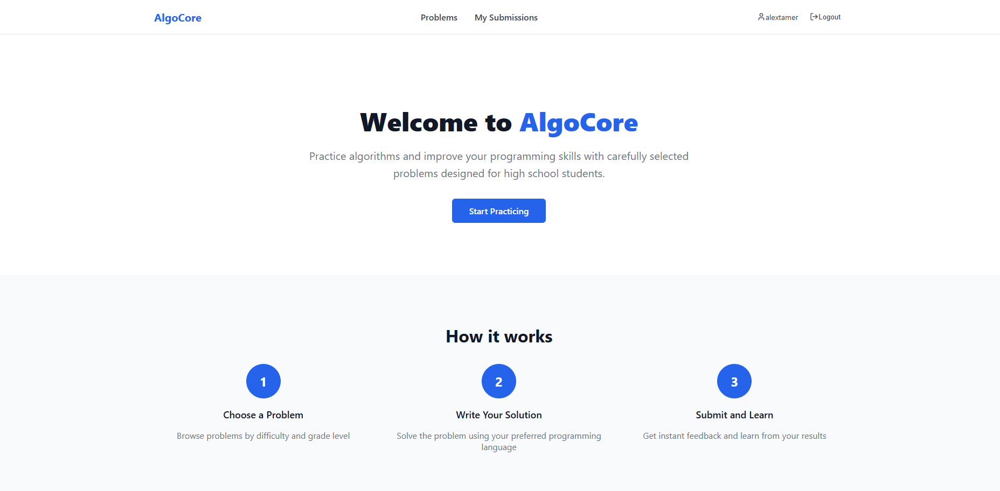
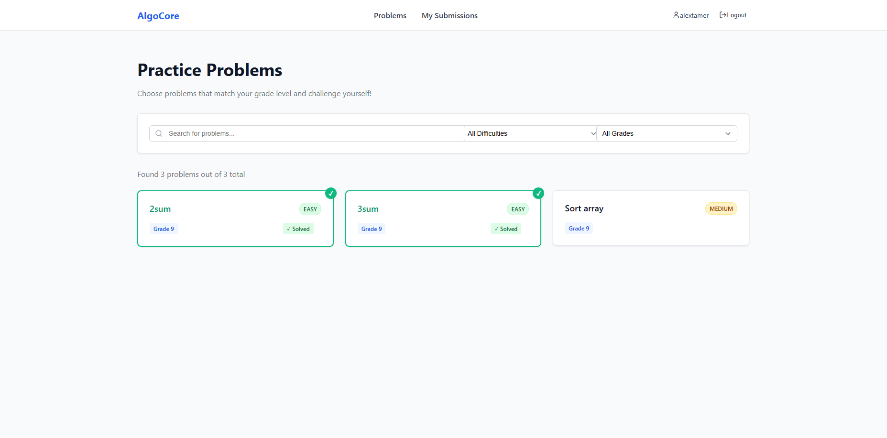
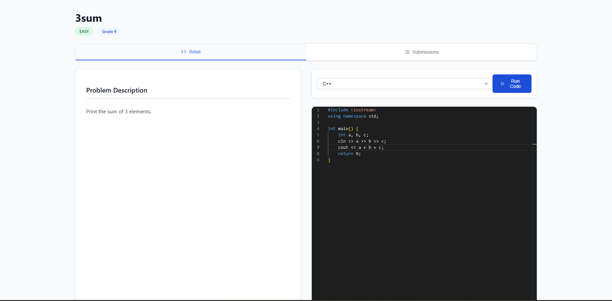
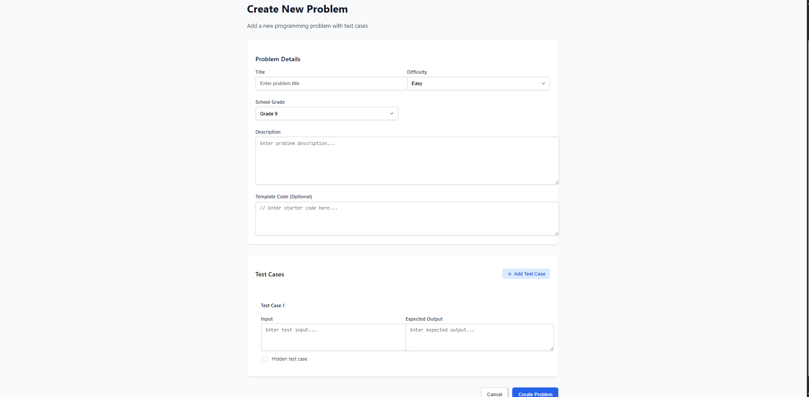
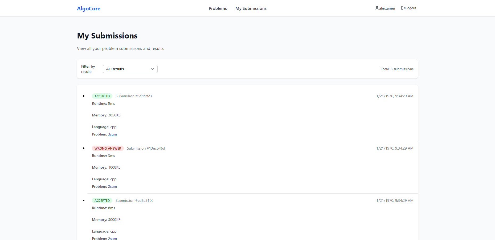

# 🧑‍💻 Algocore - Programming Assessment Platform

A full-stack Programming Assesment platform for practicing coding problems, submitting solutions, and tracking progress.  
Built with **Java (Spring Boot)** for the backend and **React** for the frontend (the frontend is done with the help of Cursor).

---

## 🛠️ Tech Stack

**Backend**: Java, Spring Boot, PostgreSQL, JPA  
**Frontend**: React
**Extras**: Judge0 for sandboxed code execution, Redis caching for performance  

---

## 🚀 Features

- 📚 **Problem Management** – Create, view, and manage coding problems  
- 📝 **Code Submissions** – Write and submit solutions, view results in real-time  
- 📊 **Submission History** – Track past attempts and outcomes  
- 🔍 **Problem Search** – Browse and filter problems  
- 🖼 **Modern UI** – Clean and intuitive interface  

---

## 📸 Demo Screenshots

### Home

### Problem List

### Problem Details

### Create a Problem (admin only)

### Submissions

